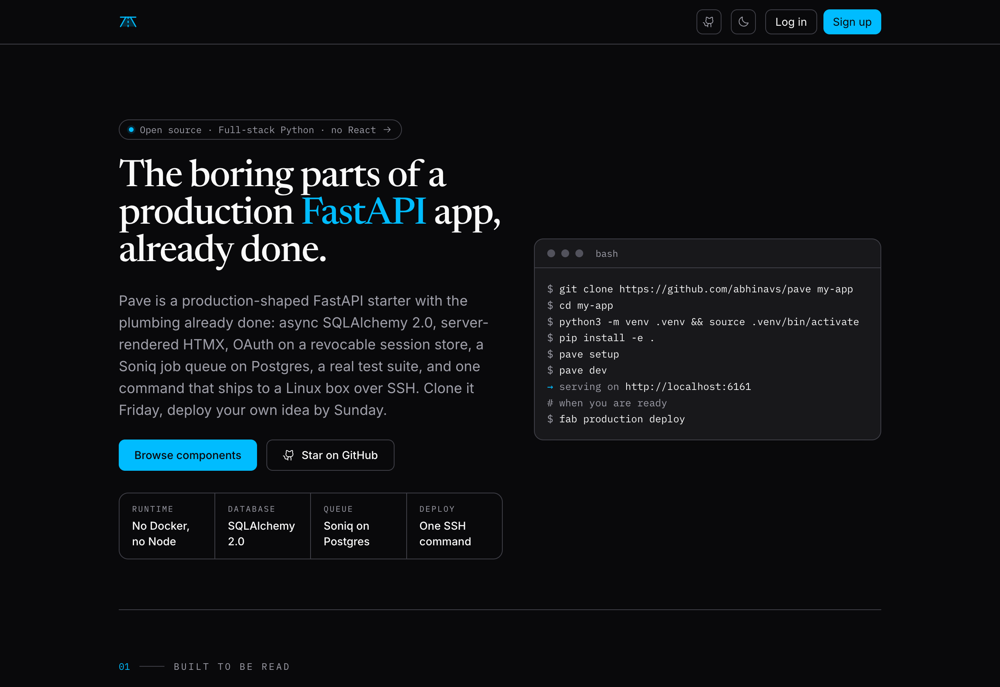

# Pave

A production FastAPI template you deploy with SSH. No Docker. No Kubernetes. No Node build step. Start on one Ubuntu box, add more when you need to.

You write FastAPI. Pave handles the rest: auth, background jobs, a markdown content system, HTMX components, and a deploy pipeline with health checks and automatic rollback. The boring production glue (Nginx, systemd, Gunicorn, Alembic) is wired up correctly the first time.

The name carries the idea. You pave the path before you walk it. Pave lays the production surface first, then you build on it.

---

## Quickstart

From a clean clone to a running app on your laptop:

```bash
git clone https://github.com/abhinavs/pave && cd pave
python -m venv .venv && source .venv/bin/activate
pip install -r requirements.txt -r requirements-dev.txt && pip install -e .
cp .env.example .env && pave setup && pave dev
```

Open http://127.0.0.1:8000.

> No Postgres on your machine? Set `USE_SQLITE=true` in `.env` and re-run `pave setup`. Everything works against SQLite for local dev.



---

## Deploy in one line

Once a server is prepared and `.env.production` is on it:

```bash
fab production deploy
```

That command runs the pre-deploy gate (env schema validation, CSS build, migrations, tests, type check), snapshots a new release on the server from `origin/main` (`git archive`), builds the CSS and updates the shared venv there, runs migrations, atomically flips the `current` symlink, restarts systemd, and probes `/health`. If the health check fails, it rolls back automatically before the command exits.

The full walkthrough, including fresh-VPS prep, is in [docs/deploy.md](docs/deploy.md). Plan on 15 minutes from a clean Ubuntu host to a live, TLS-terminated app.

Need more than one server? Fabric's host lists work as expected. The same `fab production deploy` command can target a pool of app servers, with a shared Postgres and a worker on whichever box you choose. The release-directory model and `/health` probe behave identically across hosts.

---

## What you get

Each item below is a thing you would otherwise spend a week wiring up.

| You want to                                            | Pave gives you                                                                                                                                       |
| ------------------------------------------------------ | ---------------------------------------------------------------------------------------------------------------------------------------------------- |
| Sign users up with email + password, Google, or GitHub | A complete auth system with email verification, password reset, OAuth, and DB-backed sessions with per-device revocation                             |
| Run slow work off the request path                     | Soniq, an offline job queue with retries. Two real jobs ship as references: webhook processing and verification email send                           |
| Build admin pages and dashboards without a SPA         | A reusable HTMX component kit with design tokens, plus partial routes and form-error patterns documented in [docs/components.md](docs/components.md) |
| Publish a blog and static pages                        | Markdown files in `content/`. No CMS, no database table                                                                                              |
| Send transactional email                               | A generic HTTP email provider. Console fallback when unconfigured. No SDK lock-in                                                                    |
| Know when production breaks                            | Structured logs, a retrying `/health` probe in CI, optional Sentry, optional Prometheus                                                              |
| Survive a bad deploy                                   | Release directories, atomic symlink flip, post-flip health check, automatic rollback                                                                 |

Everything above is wired together. You do not assemble it.

---

## What Pave deliberately leaves out

These are choices, not gaps. They keep the path from `git clone` to a live URL short.

- **No Docker, no container runtime.** Pave ships Python files to a Linux host and runs them under systemd. If you later want containers, nothing in the codebase blocks it. You just do not need them on day one.
- **No Kubernetes.** A handful of long-lived processes supervised by systemd is enough for most apps. When you actually outgrow that shape, the migration is on you, and there is no Pave-specific lock-in to undo first.
- **No Node build step.** Tailwind runs from a standalone binary. Email templates are hand-written HTML. There is no `package.json` to maintain.
- **No managed-platform glue.** Deploy is SSH and systemd. No platform CLI to install, no vendor account to create, no build minutes to pay for.

You can run Pave on a single VPS, a pool of app servers behind a load balancer, or eventually move pieces of it to managed services. The defaults assume one box because that is the fastest way to get to the first deploy, not because the design caps you there.

---

## When Pave is not the right choice

Pave is not trying to be everything. Use something else if:

- You are building a React or Vue SPA with a separate frontend build. Pave's HTMX kit and template-first rendering will fight you.
- You need a managed platform's compliance posture out of the box (SOC 2 controls, VPC peering, vendor IAM). Pave hands you the server; the compliance work is yours.
- You want a microservice architecture from day one. Pave is one app, one repo, one deploy.
- Your team will refuse to SSH into a server, ever. Pave assumes SSH is on the table.

---

## Status

|         |                                                                                       |
| ------- | ------------------------------------------------------------------------------------- |
| Version | `0.0.1` (pre-1.0, API may still shift)                                                |
| Python  | 3.12+                                                                                 |
| License | MIT                                                                                   |
| CI      | GitHub Actions: lint, typecheck, tests, schema-checked env, scheduled `/health` probe |

See [docs/production-readiness.md](docs/production-readiness.md) for the ship checklist.

---

## Documentation

- **[docs/getting-started.md](docs/getting-started.md)** - clone to deployed in 15 minutes.
- **[docs/your-first-feature.md](docs/your-first-feature.md)** - add a model, route, and template end to end.
- **[docs/why-pave.md](docs/why-pave.md)** - objections answered, comparisons to Docker / Fly / Kubernetes.
- **[docs/architecture.md](docs/architecture.md)** - one section per design decision, with the reasoning.
- **[docs/components.md](docs/components.md)** - the HTMX component kit and patterns.
- **[docs/auth.md](docs/auth.md)** - signup, OAuth, sessions, password reset.
- **[docs/background-jobs.md](docs/background-jobs.md)** - Soniq, the job queue.
- **[docs/deploy.md](docs/deploy.md)** - fresh-host walkthrough, the deploy pipeline, rollback, operations.
- **[docs/config.md](docs/config.md)** - every environment variable.
- **[AGENTS.md](AGENTS.md)** - conventions for AI-assisted edits.

---

## License

MIT, copyright 2026 [Abhinav Saxena](https://github.com/abhinavs). See [LICENSE](LICENSE). Fork it, ship it, change the name on the tin. The only requirement is keeping the copyright notice in source copies.
