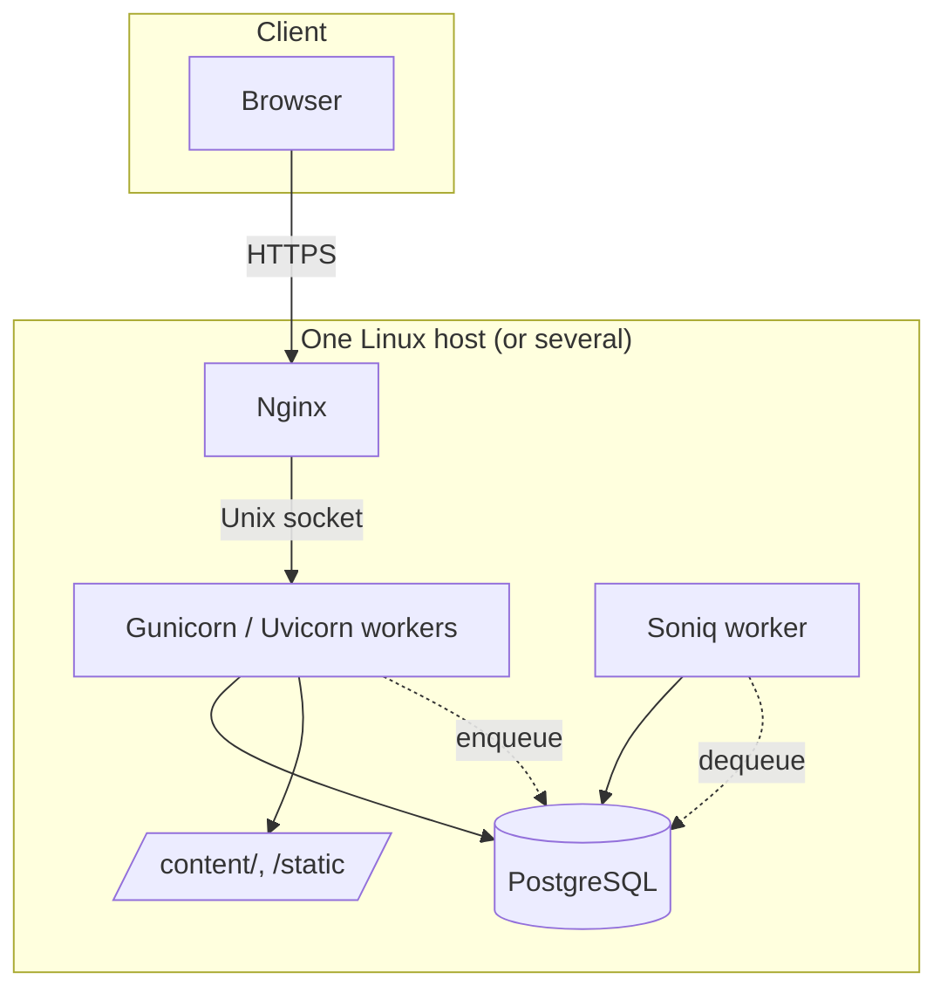

# Architecture

One section per design decision. Each section: the decision, the alternatives, the reason.

This is the "why" document. The "how" is in the focused doc linked at the end of each section.

---

## The stack

Five processes, four of which are managed by systemd: `nginx`, `pave-api` (Gunicorn supervising async Uvicorn workers), `pave-worker` (Soniq), and `postgresql`. The fifth is `certbot.timer` for renewals. No additional sidecars.

---

## Async SQLAlchemy 2.0

**Decision.** Async SQLAlchemy 2.0 with a request-scoped `AsyncSession`. No legacy `Query` API.

**Why.** FastAPI is async; mixing in a sync ORM means thread pools, hidden blocking, and a confusing mental model. SQLAlchemy 2.0's async surface is stable and well documented. Tying the session lifecycle to the request keeps transaction boundaries obvious: one request, one session, one commit.

**Alternatives considered.** Tortoise (smaller, less mature), SQLModel (a thin layer over SQLAlchemy that we did not need), raw asyncpg (too low-level for the productivity we want).

**See.** `app/database.py`, `AGENTS.md` (database access section).

---

## DTOs at every route boundary

**Decision.** Every route returns a Pydantic schema. ORM models never cross the HTTP boundary, neither as `response_model` nor as a request body.

**Why.** The database shape and the wire shape change for different reasons. A rename of an internal column should not break the API. A field added for backend use (`password_hash`, `provider_id`) should not leak. Two schemas per resource (input + output) cost almost nothing and make the API surface explicit and grepable.

**Alternatives.** ORM-as-DTO (Django-style serializers, FastAPI's `from_orm` on the model directly). Faster to write, leaks faster.

**See.** `app/schemas/`, the snippets example in [your-first-feature.md](your-first-feature.md).

---

## HTMX, not React

**Decision.** Server-rendered Jinja templates plus HTMX for interactivity. No JavaScript build.

**Why.** Most pages in most apps are not SPAs. The cost of an SPA toolchain (build step, hydration, type duplication between client and server, deploy pipeline split in two) outweighs the benefit for CRUD-shaped work, internal tools, admin pages, and marketing sites. HTMX gets you 80% of "interactive" with 5% of the moving parts. When you actually need a SPA-shaped page (a complex editor, a real-time canvas), drop in a small island; you do not have to rewrite the whole app.

**Alternatives.** React/Next.js (heavy, separate deploy story), Vue (same), Alpine (good, less batteries), pure server rendering (works, but the typing/searching/modal patterns are tedious without HTMX).

**See.** [components.md](components.md).

---

## Soniq, not Celery

**Decision.** Soniq, a Postgres-backed job queue, bundled with the app.

**Why.** Celery is excellent and operationally heavy. Most apps run hundreds to thousands of jobs per day, not millions, and the simplest queue is the one you do not have to install or monitor. Soniq runs in the database you already have; it survives crashes; it retries with backoff. When you outgrow it, swap.

**Alternatives.** Celery (broker required), Dramatiq (broker required), arq (Redis), RQ (Redis). All good. All add a process.

**See.** [background-jobs.md](background-jobs.md).

---

## Markdown content, no CMS

**Decision.** Blog posts and static pages live as markdown files under `content/`. No database table, no admin UI.

**Why.** Most app teams need three to ten static pages and a low-traffic blog. A CMS for that case is overkill and creates a separate editing workflow. Markdown in the repo means content is versioned with the code, reviewed in PRs, and deployed with the same pipeline. When the writers are also developers, this is strictly better.

**Tradeoff.** Non-developer writers cannot edit. If that matters, run a headless CMS alongside; Pave's content layer is small enough to replace.

**See.** `app/routers/blog.py`, `app/routers/pages.py`, `content/`.

---

## SSH + systemd, not Docker

**Decision.** Deploy is `rsync` over SSH plus a systemd restart. Release directories with an atomic symlink flip. No containers.

**Why.** A single-app deployment does not benefit enough from containers to justify the operational surface (image build, registry, orchestrator, secrets at runtime, image vulnerability scanning). systemd already solves restart-on-crash, log capture, dependency ordering, and resource limits. The deploy code is one short Python file you can read end to end.

**Alternatives.** Docker Compose (next step up), Kubernetes (for fleets), managed platforms (for early-stage projects).

**See.** [deploy.md](deploy.md), `fabfile.py`.

---

## Fabric for remote tasks, Typer CLI for local

**Decision.** Local commands are `pave` subcommands (Typer). Remote and SSH commands are `fab` tasks (Fabric). One verb each, no Makefile.

**Why.** Local commands should be fast and run inside the venv directly; Fabric's shell hop is overhead for local work. Remote commands genuinely need SSH and host targeting, which Fabric is purpose-built for. Splitting them keeps both files small and grep-able.

**See.** `app/cli.py`, `fabfile.py`.

---

## vrk for CI and deploy plumbing

**Decision.** Use [vrk](https://vrk.sh) for env schema validation, retrying health probes, log masking, and release stamping.

**Why.** Each of these is a single shell line per workflow that hides real correctness in its flags (validating shape vs presence, retrying with exponential backoff vs naive sleep, masking secrets in CI logs). vrk packages the correct flags. The alternative is reimplementing them in bash and getting them subtly wrong.

**Constraint.** vrk is deploy-only. Never call it from `app/` Python.

**See.** `.github/workflows/`, `fabfile.py`.

---

## Single VPS as the default, not the ceiling

**Decision.** Defaults assume one host because that minimises time to first deploy. Nothing in the architecture caps you there.

**Why.** Optimising for "fast to ship" is a different problem than "fast to scale." Most apps never need to scale past one well-tuned VPS; the small minority that do can add hosts to Fabric's list, move Postgres to a managed instance, and put a load balancer up front. All incremental moves on top of the same code.

**See.** [deploy.md](deploy.md).

---

## Dark mode is the default

**Decision.** `<html data-theme="dark">` is the default. Light mode is a complete alternate, not an afterthought.

**Why.** Most modern developer-facing apps default to dark; designing dark-first catches contrast and elevation bugs that get papered over when light is the design baseline. The `theme_toggle` component covers users who prefer light or system.

**See.** [components.md](components.md).

---

## DB-backed sessions, not JWT

**Decision.** Sessions are rows in a `sessions` table. The cookie holds an opaque token that the server resolves to a user on every request.

**Why.** Revocation is one row update. Active-devices listing is one query. JWT's appeal (no DB lookup per request) is irrelevant for a monolith and harmful when you need to invalidate a session immediately. JWT is the right call for federated APIs, not for first-party browser sessions.

**See.** [auth.md](auth.md).

---

## What we explicitly did not do

- **A plugin system.** Pave is a starting point you fork; abstraction layers for "future modules" would be premature.
- **An ORM-free path.** Repository pattern over async SQLAlchemy is fine, but the starter assumes you will write queries against the session.
- **A multi-tenant model.** Tenancy choices belong to the application, not the framework. Add a `tenant_id` column when your domain needs one.
- **JWT.** See above.
- **A frontend build pipeline.** See HTMX above.
