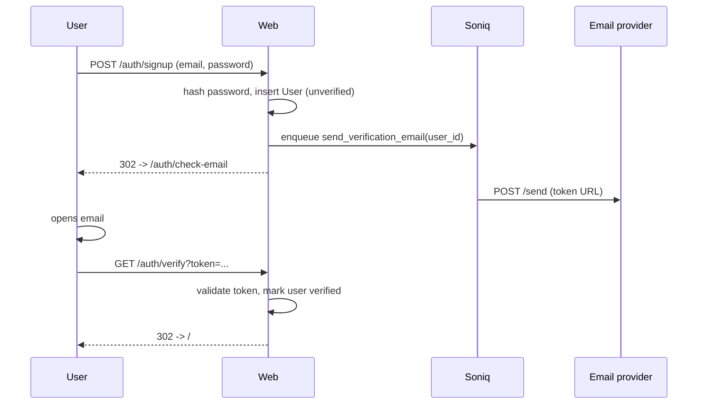

# Auth

Pave's auth covers signup, email verification, password reset, OAuth with Google and GitHub, and database-backed sessions with per-device revocation. It is wired the day you clone.

## What is wired

| Route | What it does |
|---|---|
| `GET /auth/signup` | Signup form |
| `POST /auth/signup` | Create account, enqueue verification email |
| `GET /auth/verify?token=...` | Mark account verified (direct click from inbox) |
| `POST /auth/verify` | Same effect, from the `/auth/confirm` page |
| `POST /auth/resend` | Resend verification email |
| `GET /auth/login` | Login form |
| `POST /auth/login` | Issue session cookie |
| `POST /auth/logout` | Revoke this device's session |
| `GET /auth/forgot` | Forgot-password form |
| `POST /auth/forgot` | Send password reset email |
| `GET /auth/reset?token=...` | Reset form |
| `POST /auth/reset` | Set new password |
| `GET /auth/sessions` | List your active devices |
| `POST /auth/sessions/{id}/revoke` | Revoke one device |
| `POST /auth/sessions/revoke-others` | Sign out every other device |
| `GET /auth/{provider}` | Start OAuth dance (Google or GitHub) |
| `GET /auth/{provider}/callback` | Finish OAuth dance |

All flows live in `app/routers/auth.py`. Helpers (hashing, tokens, sessions, OAuth) are in `app/auth/`.

---

## Gating a route

Two dependencies do all the work:

```python
from app.auth.dependencies import require_user, require_verified_user

@router.get("/account")
async def account_page(
    request: Request,
    user: User = Depends(require_verified_user),
    db: AsyncSession = Depends(get_db),
):
    ...
```

- `require_user` - signed in (verified or not). Use for pages users can see during onboarding.
- `require_verified_user` - signed in AND verified. Use for everything that touches real data.

If the user is not signed in, `require_user` raises a 303 to `/auth/login`. If they are signed in but not verified, `require_verified_user` raises a 303 to `/auth/verify-needed`. There is no `?next=` round-trip today: a successful login lands at `/`.

For an optional-user pattern (page works either way), use the soft dependency:

```python
from app.auth.dependencies import get_current_user

@router.get("/")
async def home(
    request: Request,
    user: User | None = Depends(get_current_user),
):
    ...  # user is None when not signed in
```

---

## The signup flow end to end



The email send is offline (`app/jobs/send_verification_email.py`), so signup latency does not depend on the email provider. If the provider is down, retries cover transient 5xxs; the user can also click "Resend".

---

## OAuth: Google and GitHub

Both are wired in `app/auth/oauth.py`. To enable, set the four environment variables in `.env`:

```bash
GOOGLE_CLIENT_ID=...
GOOGLE_CLIENT_SECRET=...
GITHUB_CLIENT_ID=...
GITHUB_CLIENT_SECRET=...
```

Unset values disable the provider; the login page hides the button automatically.

**Adding a new provider** (e.g. Microsoft):

1. Register the OAuth app with the provider; whitelist `https://your-domain/auth/microsoft/callback`.
2. Add `MICROSOFT_CLIENT_ID` and `MICROSOFT_CLIENT_SECRET` to `.env.example`, `.env.schema`, and `app/settings.py` (see `AGENTS.md` for the three-place rule).
3. Add the provider entry in `app/auth/oauth.py` with the authorize URL, token URL, and userinfo URL.
4. Add `"microsoft"` to the allow-list inside `oauth_start` and `oauth_callback` in `app/routers/auth.py`; without it the route returns 404.

---

## Sessions and revocation

Pave uses database-backed sessions, not pure signed cookies. Each row in `sessions` carries `user_id`, `token_hash`, `user_agent`, `ip_address`, `created_at`, `last_used_at`, `expires_at`, and `revoked_at`. The cookie holds an opaque urlsafe token (256 bits of entropy); only its sha256 hex lands on disk, so a database dump cannot be replayed as a valid cookie. The server resolves cookie to hash to row to user on every request.

Why DB-backed: you can revoke any session immediately. `GET /auth/sessions` lists the current user's active devices with per-row revoke and a one-click "sign out every other device". Compromised cookie, one click, done.

To revoke from code:

```python
from app.auth.sessions import (
    revoke_session,            # by row id
    revoke_session_by_token,   # by raw cookie value (used on logout)
    revoke_all_for_user,       # every active row for a user
)

await revoke_session(db, session_id)
await revoke_all_for_user(db, user_id)
```

`revoke_all_for_user` is what runs from "sign out everywhere" and after a successful password reset.

The default cookie lifetime is two weeks (`DEFAULT_MAX_AGE` in `app/auth/sessions.py`). `last_used_at` is only written when the stored value is older than one minute, so the common read path stays read-only.

---

## Password reset

```bash
POST /auth/forgot     # form field: email=...
```

The response is always the same 303 to `/auth/login?reset=requested`, whether the address is registered or not, so the route never reveals which case happened. If the account exists and has a password set (OAuth-only accounts are skipped), `app/routers/auth.py` calls `send_email` inline (no job queue) with a signed link valid for 24 hours (`EMAIL_TOKEN_MAX_AGE` in `app/auth/tokens.py`). The link lands on `GET /auth/reset?token=...`, which renders the form; `POST /auth/reset` rotates the password and calls `revoke_all_for_user` so every device, including any attacker's, is signed out.

The token is single-use by construction: it embeds a fingerprint of the current `password_hash`, so a successful reset replaces the hash and any older token stops validating. See `pw_fingerprint` and `verify_reset_token` in `app/auth/tokens.py`.

---

## Security defaults

What the codebase actually does today, no more and no less:

- Session cookies are `HttpOnly`, `SameSite=Lax`, and `Secure` when `DEBUG=False` (see `_set_session` in `app/routers/auth.py`).
- CSRF uses `starlette-csrf` (double-submit cookie scheme, cookie `csrftoken`, header `x-csrftoken`) and is only installed when `DEBUG=False`. In debug the protection is off so the local form posts and tests are not blocked. See `install_middleware` in `app/middleware.py`.
- The app sets these response headers on every request: `X-Content-Type-Options: nosniff`, `X-Frame-Options: DENY`, `Referrer-Policy: strict-origin-when-cross-origin`, `X-XSS-Protection: 0`. There is no HSTS header in the app today. If you terminate TLS at Nginx, add `Strict-Transport-Security` there.
- Rate limiting (slowapi, keyed by client IP, disabled when `DEBUG=True`): `POST /auth/login` 5/min, `POST /auth/forgot` 5/min, `POST /auth/resend` 3/min. `POST /auth/signup` and `POST /auth/reset` are not rate-limited today.
- Passwords are hashed with bcrypt (`bcrypt.gensalt()` / `bcrypt.checkpw`, see `app/auth/password.py`). Salt and cost factor travel with the hash.
- OAuth-only accounts have `password_hash = None`. `verify_password` returns `False` against a `None` hash, so a "password login" attempt against an OAuth-only account fails the same way a wrong password does.

You do not need to wire any of these. They are the defaults.

---

## What to build next

- A new OAuth provider -> follow the three-place rule above.
- A passwordless magic-link flow -> the verification email path is the template; swap "verify email" for "log in".
- An API token system for programmatic clients -> a sibling to sessions, in a new `api_keys` table.
