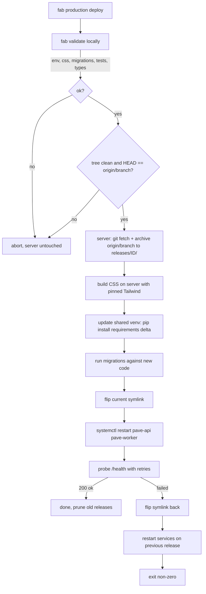

# Deploy

The end-to-end deploy reference. For your first deploy, [Getting Started](getting-started.md) is the friendlier walkthrough. This page is what you come back to once Pave is running and you need to harden, scale, or debug.

## The deploy in one diagram



Three important properties:

1. **Nothing touches the server until `fab validate` passes locally.** A broken commit cannot ship.
2. **What you tested is what ships.** The server builds the release from `origin/<branch>`, and the preflight refuses to deploy unless your working tree is clean and local `HEAD` is the tip of that branch. So the commit validate ran against is the exact commit the server checks out.
3. **The symlink flip is the only atomic moment.** Before it, the server is on the old release. After it, the new release is live. If the post-flip health check fails, the symlink flips back automatically and the previous release restarts.

---

## Fresh-server prep

Covered step by step in [Getting Started, Part 3](getting-started.md#part-3---prepare-a-vps). Checklist:

- [ ] `deploy` user with passwordless sudo for `systemctl`
- [ ] PostgreSQL installed, database and role created
- [ ] `nginx` installed, site configured
- [ ] `/srv/pave/` owned by `deploy`
- [ ] `.env.production` placed at `/srv/pave/shared/.env.production`
- [ ] `deploy` user can read the git repo (a deploy key in `~deploy/.ssh`, matching `GIT_REPO` in `fabfile.py`)
- [ ] systemd units installed and enabled (they will fail until first deploy lands)
- [ ] TLS via certbot

`fab production setup-server` bootstraps the parts the deploy needs on a fresh box: it clones the repo into `/srv/pave/repo`, downloads the pinned Tailwind binary into `/srv/pave/shared/bin`, and creates the shared venv. It is idempotent, and `deploy` does all three on demand anyway, so it is a convenience, not a requirement.

After this, every deploy is `fab production deploy`.

A `fab production setup-tls` task ships with the repo for one-shot host hardening (firewall, TLS bootstrap). Read it before running it on a host you have already configured manually.

### Environments

Targets live in `_TARGETS` in `fabfile.py` (`staging` and `production` ship by default; add your own). Each has a `host`, a `domain`, and the `branch` the server snapshots. Select one by chaining its name before the task:

```bash
fab staging deploy        # deploy to staging
fab production deploy      # deploy to production
fab staging logs          # any task can be targeted this way
```

A bare task with no selector uses `DEFAULT_ENV` (set to `staging` in `fabfile.py`), and prints which environment it picked so a `fab deploy` is never ambiguous about where it landed. Staging is the default on purpose: the dangerous target, production, always has to be named in full (`fab production deploy`). Change `DEFAULT_ENV` if your single host is production.

### On-server layout

```
/srv/pave/
├── repo/                       git clone; release snapshots are cut from it
├── current -> releases/<id>    atomic symlink to the live release
├── releases/<id>/              one per deploy (<epoch>-<short hash>), kept: 5
├── shared/                     survives every deploy
│   ├── .env.production         loaded by the systemd units
│   ├── venv/                   the one venv all releases run from
│   ├── bin/tailwindcss         pinned standalone binary, used to build CSS
│   └── uploads/                user uploads, symlinked into each release
└── backups/                    pg_dump output (fab backup, nightly timer)
```

---

## The pipeline, step by step

### 1. `fab validate` (local)

Runs in order: CSS build (`bin/tailwindcss`), migrations against a scratch DB, the full test suite, mypy. Stops at the first failure. The server is not contacted until validate succeeds.

### 2. Preflight and release stamping

The deploy refuses to run unless your working tree is clean and local `HEAD` is the tip of the branch the target ships (`origin/main` by default; see `branch` in `_TARGETS`). This is what makes "what you tested is what ships" true: the server checks out that branch, so it must equal the commit validate just ran against.

`vrk epoch` produces a timestamp, and the server resolves `origin/<branch>` to a short commit hash. Together they name the release directory, like `1748352192-a1b2c3d`. The id names the directory, the journald log span, and the rollback target.

### 3. Snapshot from the server-side clone

The server keeps its own clone at `/srv/pave/repo`. The deploy runs `git fetch` there, then `git archive origin/<branch> | tar -x` into `/srv/pave/releases/{id}/`. `git archive` exports only tracked files and never the `.git` directory, so local secrets (`.env`), the dev sqlite db, and tool caches cannot ride along: they are gitignored, therefore untracked, therefore absent. There is no laptop-to-server file copy and no `--delete` cleanup to get wrong.

The deploy user needs read access to the repo (a deploy key). The clone is created automatically on the first deploy if it is missing.

### 4. Build the CSS on the server

`app.css` is a gitignored build artifact, so the snapshot has none. The pinned Tailwind standalone binary at `/srv/pave/shared/bin/tailwindcss` (downloaded once, version `TAILWIND_VERSION` in `fabfile.py`) rebuilds it in place: `tailwindcss -i static/css/source.css -o static/css/app.css --minify`. No Node, no CI: the build happens on the box during deploy.

### 5. Update the shared venv

All releases run from one venv at `/srv/pave/shared/venv`. The deploy runs `pip install -r requirements.txt` against it, which only installs the requirements delta, so deploys after the first are fast. The trade-off: a *removed* dependency lingers in the venv until you recreate it, and a rollback does not restore the previous dependency set. When you drop a dependency (or upgrade Python on the host), run `fab production rebuild-venv`, which deletes the venv and rebuilds it from the live release's requirements.

### 6. Migrations

`alembic upgrade head` runs against the production database, against the *new* release's code. The old release is still serving traffic. Migrations must therefore be backward-compatible with the old code: add columns, do not drop or rename them in the same deploy.

### 7. Symlink flip

`/srv/pave/current` -> `/srv/pave/releases/{new-id}/`. This is a single `ln -sfn` call; readers of `current` either see the old target or the new one, never an empty pointer.

### 8. Restart services

`sudo systemctl restart pave-api pave-worker`. The restart is graceful, not a hard kill: `SIGTERM` makes Gunicorn stop accepting new connections and finish in-flight requests (up to `--graceful-timeout`), and makes the worker finish its current job before exiting. `TimeoutStopSec` in each unit bounds the drain so a stuck request or job cannot wedge the deploy. systemd then starts the services fresh, which re-resolves the `current` symlink to the new release. Both units run from the shared venv (`/srv/pave/shared/venv/bin/...`); the code is found via `WorkingDirectory=/srv/pave/current`.

A full restart (rather than a `reload`) is deliberate: the code lives behind the `current` symlink, and only a fresh start re-resolves it to the new release. If you need strict zero-downtime at the socket layer (no brief 502 window), put a second app host behind the load balancer and deploy them one at a time.

### 9. Health probe

`vrk coax | vrk grab | vrk assert '.status == "ok"'` against `https://your-domain/health`, with retries and exponential backoff. The probe checks both HTTP 2xx and JSON shape. A 200 with `{"status":"degraded"}` is treated as failure.

### 10. On success or failure

On success, releases beyond the newest `KEEP_RELEASES` (5) are pruned. On failure, the Fabric task flips the symlink back, restarts the services on the previous release, and exits non-zero.

---

## Hardening

The defaults in `deploy/nginx.conf` and the systemd units include HSTS, `X-Content-Type-Options`, modern TLS ciphers, and a request-size cap. The remaining work is at the OS level.

### UFW (firewall)

```bash
sudo ufw default deny incoming
sudo ufw default allow outgoing
sudo ufw allow 22/tcp
sudo ufw allow 80/tcp
sudo ufw allow 443/tcp
sudo ufw enable
```

### fail2ban

```bash
sudo apt-get install -y fail2ban
# /etc/fail2ban/jail.d/sshd.local
[sshd]
enabled = true
maxretry = 3
bantime = 1h
```

### Unattended upgrades

```bash
sudo apt-get install -y unattended-upgrades
sudo dpkg-reconfigure -plow unattended-upgrades
```

### journald caps

The app logs to stdout (structured JSON via structlog), and systemd captures that into the journal, so log retention is a journald setting rather than the app's job. Read the logs with `fab logs` or `journalctl -u pave-api`.

`deploy/journald.conf` ships the caps so a chatty deploy day does not eat your disk:

```ini
[Journal]
SystemMaxUse=2G
SystemKeepFree=2G
SystemMaxFileSize=200M
```

Install it with `fab production setup-log-rotation`, which copies it to `/etc/systemd/journald.conf.d/pave.conf` (a drop-in, so it overrides the distro defaults without touching the main config) and restarts `systemd-journald`. Tune the numbers in `deploy/journald.conf` for your disk and re-run the task.

### Disable root SSH

```bash
# /etc/ssh/sshd_config.d/no-root.conf
PermitRootLogin no
PasswordAuthentication no
```

`sudo systemctl restart sshd`. Confirm you can still log in as `deploy` *before* closing the second terminal.

---

## Multiple hosts

Pave starts on one host. Growing to more is a Fabric host-list change, not a redesign.

### Two app hosts, shared Postgres

```python
# fabfile.py
@task(hosts=["deploy@app1.example.com", "deploy@app2.example.com"])
def production(c): ...
```

`fab production deploy` builds a release on each host in parallel (each fetches `origin/<branch>` into its own clone and archives it) and runs migrations once (Alembic detects the no-op on the second host). Put a load balancer in front (Nginx, Caddy, HAProxy, or your cloud's LB) pointed at both Gunicorn sockets over a private network.

### Separate worker host

Move `pave-worker.service` to a dedicated host. The worker only needs the same `.env.production` and a route to the database. A Fabric task can target a different host list for the worker role.

### Same Postgres, different roles

Postgres on its own box (managed or VM) is usually the first move. Set `DATABASE_URL` on each app/worker host to point at it. Nothing else changes.

---

## Backups

`deploy/backup.service`, `deploy/backup.timer`, and `deploy/backup.sh` ship with the repo. The script runs `pg_dump`, computes a sha256 digest, and writes a compressed dump under `/var/backups/pave/`. Install:

```bash
sudo cp deploy/backup.service deploy/backup.timer /etc/systemd/system/
sudo systemctl enable --now backup.timer
```

Defaults: daily, 14 days of dumps retained. Edit `deploy/backup.sh` to push to S3, B2, or a remote host.

`fab backup` runs an on-demand dump; `fab restore` is the inverse. Both call `vrk digest --algo sha256 --compare` so a silently corrupted dump fails fast.

> **Backups you have not restored are not backups.** Once a quarter, restore the latest dump into a scratch database and run the app against it. The first time you actually need a backup is the wrong time to discover that the dumps are empty.

---

## Rollback

Automatic, on health-check failure. Manual:

```bash
fab rollback
```

This flips `current` to the previous release and restarts the services. No database changes are undone; migrations need their own reversal if they shipped breaking changes, which is the reason migrations should be backward-compatible in the first place (see [migrations.md](migrations.md)).

---

## Troubleshooting

### `fab production deploy` hangs

Almost always SSH. Run `ssh deploy@your-server "echo ok"` directly and see whether it returns. If `sudo` prompts for a password, the sudoers rule for `deploy` is missing or wrong.

### "validate failed" before anything ships

Good. Read the output - it points at exactly one of: env schema, CSS build, migrations, tests, mypy. Fix locally, re-run.

### Deploy succeeded, site returns 502

Gunicorn is not listening on `/run/pave/pave.sock`. Check `journalctl -u pave-api -n 100`. Most common: a missing env var, or a syntax error in code that imports at startup.

### Deploy succeeded, site loads, but the new feature is missing

Browser cached. Hard reload. If still missing, you deployed from the wrong branch - check `git log -1` matches the release id stamped in the deploy output.

### `/health` returns 200 but the app is actually broken

The health endpoint is shallow on purpose. Deepen it in `app/routers/health.py` for the checks that matter to you (DB ping, queue depth, an external dependency). The deploy probe will pick up the new shape automatically.

### `fab logs` shows nothing

The service is not running, or you are targeting the wrong host. `fab ssh` to confirm, then `systemctl status pave-api pave-worker`.
